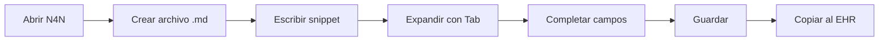

<div align="center">

# 🏥 N4N - Nursing Neovim

**Asistente de texto especializado para escribir evoluciones de enfermería**

[](LICENSE)
[](https://neovim.io/)
[](https://github.com)

[Características](#-características) •
[Instalación](#-instalación) •
[Uso](#-uso) •
[Roadmap](#-roadmap) •
[Contribuir](#-contribuir)

</div>

---

## 📋 Tabla de Contenidos

- [¿Qué es N4N?](#-qué-es-n4n)
- [Características](#-características)
- [Flujo de Trabajo](#-flujo-de-trabajo)
- [Instalación](#-instalación)
- [Uso](#-uso)
- [Estructura del Proyecto](#-estructura-del-proyecto)
- [Documentación](#-documentación)
- [Roadmap](#-roadmap)
- [Contribuir](#-contribuir)
- [Licencia](#-licencia)

---

## 🎯 ¿Qué es N4N?

**N4N** es un entorno de desarrollo especializado basado en Neovim, diseñado específicamente para profesionales de enfermería que necesitan redactar evoluciones clínicas de manera eficiente.

### ✅ Lo que N4N ES

- **Editor de texto aislado**: Neovim configurado con `NVIM_APPNAME=nvim-n4n` para no interferir con tu configuración personal
- **Snippets clínicos inteligentes**: Sistema basado en LuaSnip + VSCode-style que se expanden con Tab
- **Formato markdown**: Archivos simples `.md` listos para copiar/pegar al EHR
- **Sin dependencias externas**: No requiere backend, base de datos ni conexión a internet
- **Productividad enfocada**: Reduce el tiempo de documentación de 10-15 min a 3-5 min por evolución


> **Filosofía**: N4N = Neovim + Snippets + Markdown. Simple, rápido y efectivo.

---

## ✨ Características

- 🚀 **Expansión rápida de snippets** con navegación por campos usando Tab
- 📝 **Plantillas clínicas especializadas** para diferentes tipos de evoluciones
- ⚡ **Configuración aislada** que no afecta tu Neovim personal
- 🎨 **Interfaz moderna** basada en GentlemanNvim con LSP y Telescope
- 🔍 **Sistema de búsqueda avanzado** para encontrar evoluciones previas
- 📦 **Autocompletado inteligente** con choice nodes (Ctrl+l / Ctrl+h)
- 💾 **Sin instalación compleja**: Copia y listo para usar

---

## 🚀 Flujo de Trabajo



### Pasos detallados

1. **Iniciar N4N**
   ```bash
   n4n
   ```

2. **Crear nueva evolución**
   ```vim
   :e turno-2025-11-25.md
   ```

3. **Usar snippets**
   - Escribe `evo` + Tab → Cabecera completa de evolución
   - Escribe `evon` + Tab → Bloque neurológico
   - Navega entre campos con Tab

4. **Completar información**
   - Rellena los campos clínicos
   - Usa choice nodes para valores predefinidos

5. **Guardar y transferir**
   ```vim
   :w
   ```
   - Copia el contenido al EHR oficial del hospital

**⏱️ Tiempo estimado**: 3-5 minutos por evolución (ahorro del 60-70%)

---

## 📦 Instalación

### Requisitos Previos

- Neovim ≥ 0.9.0
- Git
- Acceso a terminal (macOS/Linux)

### Instalación Rápida

```bash
# 1. Clonar el repositorio
git clone https://github.com/fegome90-cmd/n4n_nvim_macos.git
cd n4n_nvim_macos

# 2. Copiar configuración
cp -r config/nvim ~/.config/nvim-n4n

# 3. Crear alias (opcional pero recomendado)
echo 'alias n4n="NVIM_APPNAME=nvim-n4n nvim"' >> ~/.zshrc
source ~/.zshrc

# 4. Lanzar N4N
n4n
```

### Instalación Manual

Si prefieres no usar el alias, puedes lanzar N4N directamente:

```bash
NVIM_APPNAME=nvim-n4n nvim
```

---

## 🎮 Uso

### Snippets Disponibles

| Snippet | Descripción | Expansión |
|---------|-------------|-----------|
| `evo` | Cabecera de evolución completa | Tab |
| `evon` | Bloque neurológico | Tab |
| `evoc` | Bloque cardiovascular | Tab (próximamente) |
| `evor` | Bloque respiratorio | Tab (próximamente) |

### Atajos de Teclado

| Atajo | Acción |
|-------|--------|
| `Tab` | Expandir snippet / Siguiente campo |
| `Shift+Tab` | Campo anterior |
| `Ctrl+l` | Siguiente opción en choice node |
| `Ctrl+h` | Opción anterior en choice node |
| `:w` | Guardar archivo |
| `:q` | Salir |

### Ejemplo de Uso

```markdown
# Evolución de Enfermería - Turno Noche
**Fecha**: 2025-11-25
**Hora**: 20:00

## Sistema Neurológico
- Paciente consciente, orientado en tiempo, espacio y persona
- Glasgow 15/15 (AO4, RV5, RM6)
- Pupilas isocóricas, reactivas a la luz
- Sin déficit motor aparente
```

---

## 📁 Estructura del Proyecto

```
n4n_nvim_macos/
├── config/nvim/              # Configuración completa de Neovim
│   ├── init.lua              # Punto de entrada
│   ├── lua/                  # Módulos Lua
│   └── snippets/             # Snippets clínicos VSCode-style
│       ├── nursing.json      # Snippets de enfermería
│       └── package.json      # Metadatos VSCode
├── registros/                # Casos de prueba y evoluciones
├── scripts/                  # Utilidades y launcher
├── templates/                # Plantillas markdown
└── docs/                     # Documentación técnica
    ├── SCOPE.md              # Alcance del proyecto
    ├── ARCHITECTURE.md       # Arquitectura técnica
    ├── IMPLEMENTATION_PLAN.md # Plan de implementación
    ├── PHASE-1-SUMMARY.md    # Resumen Fase 1
    └── VERIFICATION.md       # Verificación de funcionalidad
```

---

## 📖 Documentación

### Documentos Principales

| Documento | Descripción |
|-----------|-------------|
| [SCOPE.md](./docs/SCOPE.md) | ⭐ **Lectura obligatoria**: Define qué es y no es N4N |
| [ARCHITECTURE.md](./docs/ARCHITECTURE.md) | Arquitectura técnica y decisiones de diseño |
| [IMPLEMENTATION_PLAN.md](./docs/IMPLEMENTATION_PLAN.md) | Plan detallado de implementación por fases |
| [PHASE-1-SUMMARY.md](./docs/PHASE-1-SUMMARY.md) | Resumen de análisis de 9 PDFs clínicos |
| [VERIFICATION.md](./docs/VERIFICATION.md) | Guía de verificación y pruebas |

### Recursos Adicionales

- **Configuración base**: Adaptada de [GentlemanNvim](https://github.com/Gentleman-Programming/Gentleman.Dots)
- **Sistema de snippets**: LuaSnip + VSCode-style loader
- **LSP integrado**: Soporte para markdown y otros lenguajes

---

## 🛣️ Roadmap

### Fase 1: Análisis y Planificación (90% completo ✅)

- [x] Estructura de carpetas
- [x] Documentación técnica
- [x] Análisis de 9 PDFs clínicos
- [x] Configuración base de Neovim
- [x] Snippets iniciales (evo, evon)
- [ ] Definición final de biblioteca de snippets

### Fase 2: Implementación (En progreso 🚧)

- [ ] Snippets completos por sistemas (cardiovascular, respiratorio, etc.)
- [ ] Scripts de instalación automatizada
- [ ] Launcher multiplataforma
- [ ] Plantillas markdown adicionales
- [ ] Sistema de actualización de snippets

### Fase 3: Validación (Pendiente 📋)

- [ ] Pruebas con casos clínicos reales
- [ ] Validación de tiempos de documentación
- [ ] Ajustes basados en feedback
- [ ] Documentación de usuario final
- [ ] Release v1.0.0

---

## 🤝 Contribuir

Las contribuciones son bienvenidas. Este es un proyecto personal pero abierto a mejoras.

### Cómo Contribuir

1. Fork el proyecto
2. Crea una rama para tu feature (`git checkout -b feature/AmazingFeature`)
3. Commit tus cambios (`git commit -m 'Add: amazing feature'`)
4. Push a la rama (`git push origin feature/AmazingFeature`)
5. Abre un Pull Request

### Áreas de Contribución

- ✍️ **Snippets clínicos**: Nuevas plantillas basadas en evidencia
- 🐛 **Reportar bugs**: Issues con descripción detallada
- 📝 **Documentación**: Mejoras en docs o traducciones
- 🎨 **UI/UX**: Sugerencias de interfaz y usabilidad

---

## 📄 Licencia

Este proyecto está bajo la Licencia MIT. Ver el archivo [LICENSE](LICENSE) para más detalles.

---

## 👤 Autor

**@fegome90-cmd**

- GitHub: [@fegome90-cmd](https://github.com/fegome90-cmd)
- Proyecto base: [Gentleman.Dots](https://github.com/Gentleman-Programming/Gentleman.Dots)

---

## 🙏 Agradecimientos

- **Gentleman Programming** por la configuración base de Neovim
- **Comunidad de LuaSnip** por el potente sistema de snippets
- **Neovim Team** por el mejor editor de texto

---

<div align="center">

**⚡ Hecho con dedicación para profesionales de enfermería ⚡**

Si N4N te ayuda en tu trabajo, considera darle una ⭐

**Última actualización**: 2025-11-25

</div>
